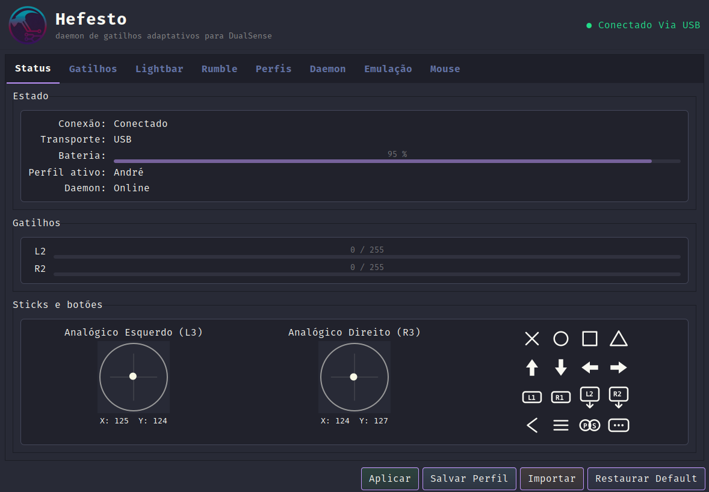
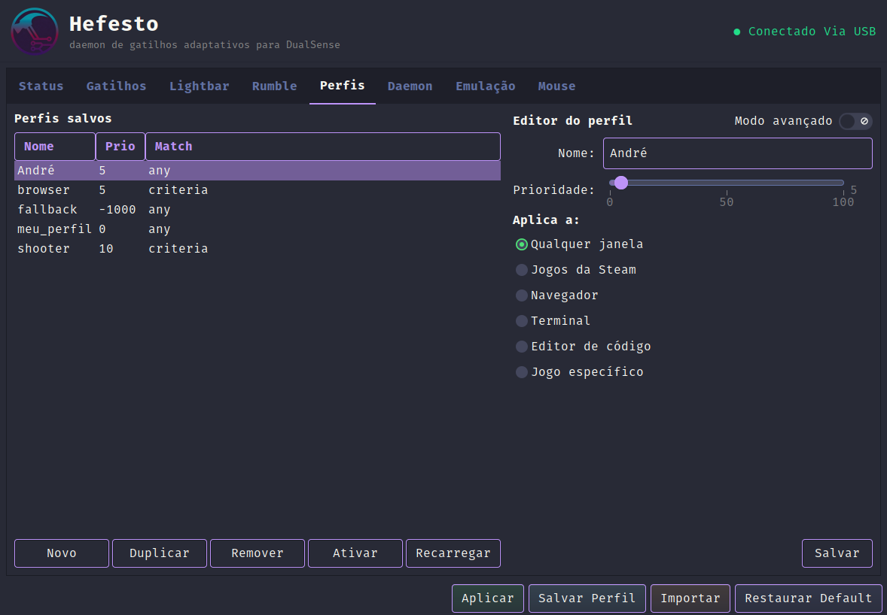
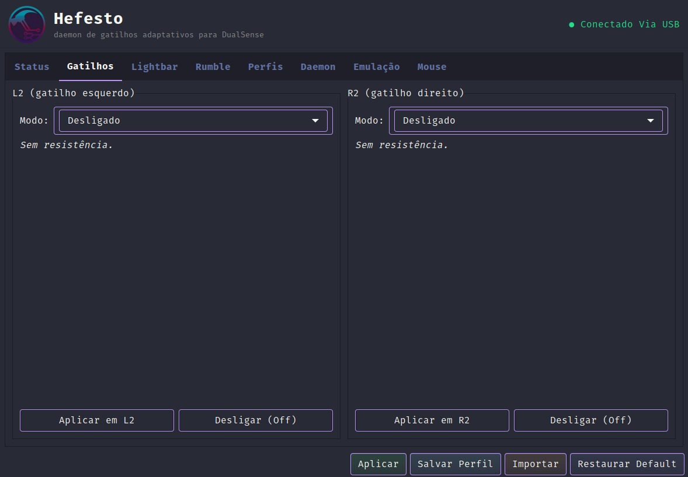
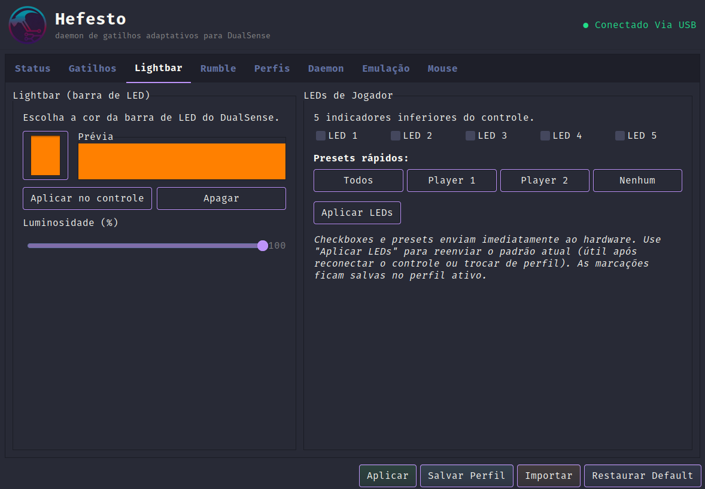
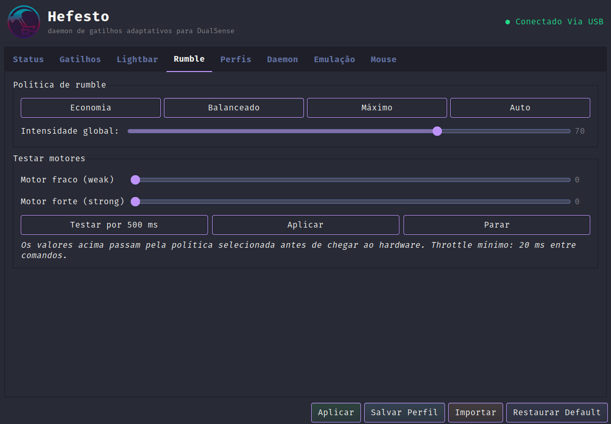
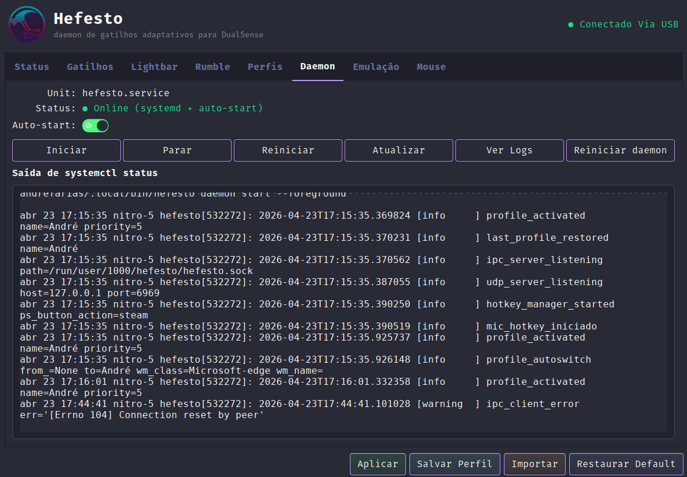
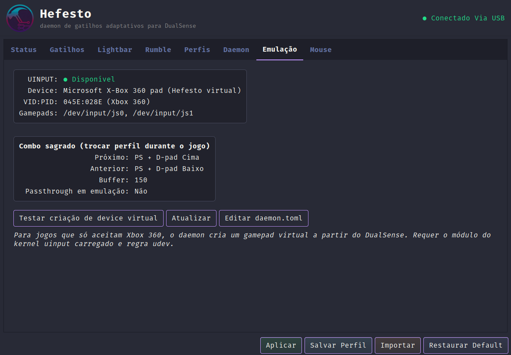

<div align="center">

[](LICENSE)
[](https://www.python.org/)
[](https://www.gtk.org/)
[](https://github.com/AndreBFarias/hefesto/releases/latest)
[](https://github.com/AndreBFarias/hefesto/releases)
[](tests/unit/)
[](https://github.com/AndreBFarias/hefesto/actions)

<div align="center">
<div style="text-align: center;">
  <h1 style="font-size: 2.2em;">Hefesto</h1>
  
</div>
</div>
</div>

---

```
Versão: 2.2.2
Estado: runtime validado em Pop!_OS 22.04 com DualSense USB/BT; 1036 testes unit, ruff clean, mypy zero
Alvo:   Linux com systemd-logind, Python 3.10+
Licença: MIT
```

---

### Descrição

Daemon Linux para gatilhos adaptativos do controle DualSense (PS5). Porte espiritual do DualSenseX (Paliverse) para Unix, escrito em Python 3.10+ com GUI GTK3, TUI Textual e CLI. Compatível com jogos que usam o protocolo UDP do DSX (Cyberpunk 2077, Forza, Assetto Corsa) e com mods customizados via Unix socket JSON-RPC.

Projetado para Pop!\_OS, Ubuntu, Fedora, Arch, Debian e Mint. Usa `evdev` para entrada (contorna o driver `hid_playstation`) e `pydualsense` para saída HID — sem precisar de `HidHide` ou `unbind` manual do kernel.

---

### Principais Funcionalidades

| Categoria | Funcionalidade |
|-----------|----------------|
| **Gatilhos adaptativos** | 19 modos validados (Rigid, Pulse, Galloping, Machine, Bow, Automatic Gun, etc.) com fábricas pydantic |
| **Compatibilidade DSX** | Servidor UDP em `127.0.0.1:6969` aceita pacotes JSON no schema Paliverse |
| **IPC local** | Unix socket em `$XDG_RUNTIME_DIR/hefesto/hefesto.sock`, JSON-RPC 2.0 sobre NDJSON, 10 métodos canônicos |
| **Perfis** | JSON validados com pydantic v2 em `~/.config/hefesto/profiles/`; 7 defaults (`navegacao`, `fps`, `aventura`, `acao`, `corrida`, `esportes`, `meu_perfil`) <!-- noqa: acentuacao --> |
| **Auto-switch** | Troca de perfil automática por janela ativa (X11 nativo, Wayland via portal XDG) |
| **Hotkeys** | Combos sagrados PS+D-pad sem exigir grupo `input`; botão Mic físico muta microfone do sistema |
| **Lightbar e LEDs** | Barra RGB + luminosidade + 5 LEDs de jogador; presets rápidos (Todos, Player 1, Player 2, Nenhum) |
| **Rumble** | Política global (Economia 0.3×, Balanceado 0.7×, Máximo 1.0×, Auto dinâmico por bateria) com debounce 5 s |
| **Emulação Xbox 360** | `uinput` virtual para jogos que só aceitam gamepads Microsoft |
| **Interface** | GUI GTK3 tema Drácula, TUI Textual com preview ao vivo, CLI `typer` com cores |
| **Plataforma** | `.deb` nativo (179 KB), bundle Flatpak `br.andrefarias.Hefesto`, AppImage, instalação via fonte |
| **Observabilidade** | Endpoint Prometheus opt-in em `127.0.0.1:9090/metrics` com 8 métricas canônicas |
| **Extensibilidade** | Plugins Python em `~/.config/hefesto/plugins/*.py` com hooks `on_tick` / `on_button_down` / `on_battery_change` |

---

### Interface

Status em tempo real com sticks L3/R3, barras de gatilho e grid 4×4 de glyphs acendendo em roxo quando pressionados.

<div align="center">

</div>

---

### Perfis e auto-switch

Editor dual: modo simples (radios Steam / Navegador / Terminal / Editor / Jogo específico) ou avançado (`window_class` / `title_regex` / `process_name`). Cada perfil tem prioridade; o matcher universal `fallback.json` (priority = -1000) garante comportamento de base.

<div align="center">

</div>

---

### Gatilhos adaptativos

Cada gatilho (L2 e R2) expõe modo + preset. Presets de feedback (resistência contínua) ou vibração (pulsos) são salvos no perfil ativo. Custom permite editar os parâmetros brutos do DualSense.

<div align="center">

</div>

---

### Lightbar e LEDs de jogador

Cor RGB 24 bits, luminosidade 0-100 % e 5 indicadores inferiores. Checkboxes e presets enviam imediatamente ao hardware; o botão **Aplicar LEDs** reemite o padrão atual (útil após reconectar o controle ou trocar de perfil).

<div align="center">

</div>

---

### Rumble — política global

Escala a intensidade de todos os comandos de vibração antes de chegar ao hardware. Modo Auto lê a bateria do controle e suaviza o rumble quando ≤ 30 % (debounce de 5 s evita oscilação).

<div align="center">

</div>

---

### Daemon — systemd e logs

Status da unidade `hefesto.service` (`--user`), toggle de auto-start e janela ao vivo de `systemctl status` com histórico de `profile_activated`, `ipc_server_listening`, `udp_server_listening` e `hotkey_manager_started`.

<div align="center">

</div>

---

### Emulação Xbox 360

Para jogos que só aceitam gamepad Microsoft, o daemon expõe `/dev/input/js*` virtuais a partir do DualSense. Requer módulo `uinput` carregado e regra udev `71-uinput.rules` (aplicadas por `scripts/install_udev.sh`).

<div align="center">

</div>

---

### Instalação

#### Ubuntu / Debian / Pop!\_OS / Mint (.deb — recomendado)

```bash
curl -LO https://github.com/AndreBFarias/hefesto/releases/download/v2.2.2/hefesto_2.2.2_amd64.deb
sudo apt install ./hefesto_2.2.2_amd64.deb
```

Depois habilite o daemon (opcional — pode rodar só via GUI):

```bash
systemctl --user enable --now hefesto.service
hefesto-gui
```

Dependências Python que não têm pacote Debian oficial:

```bash
pip install pydualsense python-uinput
```

> **Ubuntu 22.04 (Jammy) e 24.04 (Noble):** o `python3-pydantic` do apt nesses releases é **versão 1.x** (Jammy 1.8.2, Noble 1.10.14 — confirmado empiricamente em 2026-04-24). O Hefesto usa API pydantic v2 (`ConfigDict`). O `.deb` v2.2.2+ declara `python3-pydantic` sem constraint de versão, então o `apt install` funciona; porém o Hefesto imprime `ImportWarning` em runtime e falha ao tocar schemas. **Solução recomendada (2 comandos):**
>
> ```bash
> pip install --user 'pydantic>=2'
> sudo apt install ./hefesto_*.deb
> ```
>
> O Python resolve `import pydantic` preferindo `~/.local/lib/python3.X/site-packages` (pydantic v2) antes de `/usr/lib/python3/dist-packages` (pydantic v1 do apt). Zero conflito.
>
> **Alternativas:**
>
> - Migrar para **Ubuntu 25.04 (Plucky)** ou superior — `python3-pydantic 2.10+` nativo.
> - Usar **AppImage** ou **Flatpak** (seções abaixo) — ambos trazem pydantic v2 empacotado.

#### AppImage (universal)

```bash
curl -LO https://github.com/AndreBFarias/hefesto/releases/download/v2.2.2/Hefesto-2.2.2-x86_64.AppImage
chmod +x Hefesto-2.2.2-x86_64.AppImage
./Hefesto-2.2.2-x86_64.AppImage
```

#### Flatpak (COSMIC, Flathub-compatível)

```bash
flatpak install hefesto.flatpak
flatpak run br.andrefarias.Hefesto
```

#### Via fonte (desenvolvimento)

```bash
git clone git@github.com:AndreBFarias/hefesto.git
cd hefesto
./scripts/dev-setup.sh                  # idempotente: garante .venv viva + pytest --collect-only + valida PyGObject
./scripts/dev_bootstrap.sh              # apt + venv + pip install -e (primeira vez)
./scripts/dev_bootstrap.sh --with-tray  # inclui PyGObject + libs GTK (obrigatório pra GUI e para tests/unit/test_status_actions_reconnect.py)
./scripts/install_udev.sh               # regras udev + módulo uinput (pede sudo)
```

Use `scripts/dev-setup.sh` no início de cada sessão: se `.venv/` falta ou está quebrada, invoca o bootstrap automaticamente; caso contrário valida rápido com `pytest --collect-only` e avisa se PyGObject está ausente (A-12).

**Para rodar a GUI localmente (`./run.sh --gui`):** o `PyGObject` precisa estar no `.venv`. Rode `./scripts/dev_bootstrap.sh --with-tray` pelo menos uma vez — sem a flag `--with-tray`, o bootstrap não instala o pacote (evita falha pesada em máquinas sem `libgirepository-1.0-dev`). O `dev-setup.sh` detecta ausência e imprime instrução acionável. Armadilha A-12 documentada em `VALIDATOR_BRIEF.md`.

Reconecte o DualSense depois de instalar as regras udev. Confira o acesso:

```bash
ls -l /dev/hidraw* /dev/uinput          # ACL via uaccess deve estar ativa (+)
```

---

### Requisitos

**Obrigatórios:**

- Linux com `systemd-logind` ativo (Pop!\_OS, Ubuntu, Fedora, Arch, Debian, Mint).
- Python 3.10+.
- Pacotes do sistema: `libhidapi-hidraw0`, `libhidapi-dev`, `libudev-dev`, `libxi-dev`.

**Recomendados:**

- GTK 3.0 + PyGObject (para GUI).
- Textual (para TUI).
- `AppIndicator and KStatusNotifierItem Support` no GNOME 42+ (para ícone de bandeja).

**Opcionais:**

- `python-uinput` (emulação Xbox 360).
- Endpoint Prometheus em `127.0.0.1:9090` (opt-in via `hefesto.conf`).

**Fora de escopo:**

- Distros sem `logind` (Alpine OpenRC, Void runit, Gentoo/Artix com OpenRC). Ver `docs/adr/009-systemd-logind-scope.md`.
- Windows, macOS. Bluetooth Audio do DualSense (protocolo fechado).

---

### Uso

**Via menu de aplicativos:** procure por "Hefesto" (ícone na bandeja do sistema).

**Via terminal (GUI):**

```bash
hefesto-gui
```

**Via CLI (headless, sem display):**

```bash
. .venv/bin/activate

hefesto daemon start --foreground           # sobe daemon em primeiro plano
hefesto status                              # estado do daemon e controle
hefesto battery                             # percentual colorido
hefesto profile list                        # perfis em ~/.config/hefesto/profiles/
hefesto profile show shooter                # JSON do perfil
hefesto profile activate shooter            # aplica direto no hardware
hefesto test trigger --side right \
    --mode Galloping --params 0,9,7,7,10    # testa efeito sem daemon
hefesto led --color "#FF0080"               # lightbar
hefesto tui                                 # interface Textual
```

**Service systemd `--user`:**

```bash
hefesto daemon install-service              # modo gráfico (default)
hefesto daemon install-service --headless   # modo headless (SSH/Big Picture remoto)
systemctl --user enable --now hefesto.service
journalctl --user -u hefesto -f
```

**Emulação Xbox 360:**

```bash
hefesto emulate xbox360 --on                # cria /dev/input/js*, forward 60 Hz
```

Steam e a maior parte dos jogos Proton reconhecem automaticamente o novo gamepad.

Guia visual com capturas cobrindo instalação, GUI, presets e solução de problemas: **[docs/usage/quickstart.md](docs/usage/quickstart.md)**.

---

### Combo sagrado (trocar perfil durante o jogo)

| Tecla | Ação |
|-------|------|
| PS + D-pad Cima | Próximo perfil |
| PS + D-pad Baixo | Perfil anterior |
| PS (sozinho) | Steam Big Picture (ou comando custom via `hefesto.conf`) |
| Mic (botão físico) | Muta / desmuta microfone padrão do sistema |

---

### Modos de gatilho disponíveis

| Modo | Descrição |
|------|-----------|
| **Off** | Gatilho sem resistência |
| **Rigid** | Resistência contínua ajustável |
| **Pulse** | Pulsos curtos com frequência configurável |
| **Galloping** | Padrão de galope (2 pulsos espaçados) |
| **Machine** | Rajada com frequência e força variáveis |
| **Bow** | Tensão crescente simulando arco |
| **Automatic Gun** | Rajada automática contínua |
| **Feedback** | 6 presets de resistência (Leve, Médio, Forte, Progressivo, Duro, Firme) |
| **Vibration** | 5 presets de vibração (Curto, Médio, Longo, Rajada, Pulso) |

Factories canônicas em `src/hefesto/profiles/trigger_modes.py`.

---

### Matriz de compatibilidade

| Distro          | Kernel     | Systemd | USB | BT  | Tray | Notas                                   |
|-----------------|------------|---------|-----|-----|------|-----------------------------------------|
| Pop!\_OS 22.04  | 6.17       | 249+    | OK  | ?   | ?    | Runtime primário; backend híbrido ativo |
| Ubuntu 22.04+   | 5.19+      | 249+    | ?   | ?   | ?    | Mesmo ecossistema do Pop!\_OS           |
| Fedora 39+      | 6.5+       | 254+    | ?   | ?   | ?    | Esperado funcionar                      |
| Arch (rolling)  | rolling    | atual   | ?   | ?   | ?    | Comunidade                              |
| Debian 12 stable| 6.1        | 252     | ?   | ?   | ?    | Esperado funcionar                      |
| Alpine / Void   | qualquer   | —       | —   | —   | —    | Fora de escopo (sem logind)             |

`?` = não validado. Contribuições bem-vindas em `CHECKLIST_MANUAL.md` ou via issues `needs-device`.

---

### Solução de problemas

**Controle não aparece em `/dev/hidraw*`:**

1. Verifique as regras udev: `ls /etc/udev/rules.d/7*-ps5-controller*.rules`.
2. Recarregue: `sudo udevadm control --reload-rules && sudo udevadm trigger`.
3. Desconecte e reconecte o controle.

**Daemon diz "offline" mesmo com controle plugado:**

- USB autosuspend pode estar derrubando o device. A regra `72-ps5-controller-autosuspend.rules` força `power/control=on` e `power/autosuspend_delay_ms=-1` para os VID/PID `054c:0ce6` e `054c:0df2`. Instalada automaticamente por `scripts/install_udev.sh` e pelo `.deb`.
- Verifique logs: `journalctl --user -u hefesto -f`.

**Emulação Xbox 360 não cria `/dev/input/js*`:**

- Carregue o módulo: `sudo modprobe uinput`.
- Confira a regra `71-uinput.rules` e permissão do `/dev/uinput` (precisa ACL via `uaccess`).

**Cursor "voando" ao ativar Mouse:**

- Sintoma de múltiplas instâncias de daemon rodando em paralelo. Desde v2.0.0 existe `single_instance` com `flock` — se o bug aparecer, rode `pkill -TERM -f hefesto.app.main && pkill -TERM -f 'hefesto daemon'` e reinicie via `systemctl --user restart hefesto.service`. Reporte em issue.

Mais detalhes em [`docs/usage/quickstart.md`](docs/usage/quickstart.md) e [`docs/usage/troubleshooting.md`](docs/usage/troubleshooting.md) (quando existir).

---

### Estrutura do projeto

```
Hefesto-DualSense_Unix/
  src/hefesto/
    app/            # GUI GTK3 + apptray + handlers
    cli/            # entry point typer
    daemon/         # 10 subsystems (poll, ipc, udp, autoswitch, mouse, rumble, hotkey, metrics, plugins, connection)
    gui/            # main.glade + theme.css + widgets customizados
    profiles/       # schemas pydantic + gerência + matchers
    tui/            # interface Textual
    testing/        # FakeController para smoke sem hardware
    utils/          # xdg_paths, single_instance, logging_config
  assets/
    appimage/       # ícones e manifesto AppImage
    glyphs/         # SVGs originais dos botões do DualSense
    profiles_default/  # 7 perfis default
    *.rules         # udev (70..74)
    hefesto.service, hefesto-gui-hotplug.service
  scripts/
    dev-setup.sh, dev_bootstrap.sh, install_udev.sh
    validar-acentuacao.py, check_anonymity.sh, check_version_consistency.py
  tests/unit/       # 1003 testes pytest
  docs/
    adr/            # 9 Architecture Decision Records
    protocol/       # UDP schema, IPC JSON-RPC, trigger modes
    usage/          # quickstart visual + assets
    process/        # decisões V2/V3, roadmap, discoveries
  run.sh, run_luna.sh
  install.sh, uninstall.sh
  pyproject.toml, CHANGELOG.md, AGENTS.md
```

---

### Documentação

- **Guia visual rápido:** [`docs/usage/quickstart.md`](docs/usage/quickstart.md)
- **Protocolo de colaboração:** [`AGENTS.md`](AGENTS.md) (anonimato, idioma PT-BR, workflow de issue)
- **Decisões arquiteturais:** [`docs/adr/`](docs/adr/) — 9 ADRs numeradas
- **Schemas de protocolo:** [`docs/protocol/`](docs/protocol/) — UDP, IPC JSON-RPC, modos de gatilho
- **Decisões de processo:** [`docs/process/HEFESTO_DECISIONS_V2.md`](docs/process/HEFESTO_DECISIONS_V2.md), [`HEFESTO_DECISIONS_V3.md`](docs/process/HEFESTO_DECISIONS_V3.md)
- **Diário de descobertas:** [`docs/process/discoveries/`](docs/process/discoveries/) — uma jornada por arquivo
- **Changelog:** [`CHANGELOG.md`](CHANGELOG.md)
- **Roadmap:** [`docs/process/SPRINT_ORDER.md`](docs/process/SPRINT_ORDER.md)

---

### Contribuindo

Leia [`AGENTS.md`](AGENTS.md) antes de abrir PR. Resumo:

1. Pegue issue com labels `status:ready` + `ai-task`.
2. `gh issue develop N --checkout`.
3. Ative o gate local de qualidade na primeira clonagem:
   ```bash
   pip install pre-commit
   pre-commit install
   ```
   O framework instala hooks que bloqueiam commit com acentuação PT-BR faltando (`acao`, `funcao`, `descricao`, etc.), menção a IA ou falha de `ruff check`. Script canônico: [`scripts/validar-acentuacao.py`](scripts/validar-acentuacao.py).
4. Implementar + testes (pytest), `ruff`, `mypy` strict — gate rígido no CI desde V2.2: `mypy src/hefesto` tem que fechar com zero erros; [`scripts/check_anonymity.sh`](scripts/check_anonymity.sh).
5. Se toca runtime, provar via smoke real (`run.sh --smoke`) ou com hardware conectado.
6. Se toca UI / TUI, screenshot + sha256 + descrição multimodal no PR.
7. Descoberta não-óbvia vira registro em [`docs/process/discoveries/`](docs/process/discoveries/).
8. Commit em PT-BR, sem menção a IA, zero emojis gráficos (glyphs Unicode de estado — `○`, `●`, box drawing — são permitidos).
9. Abrir PR com `Closes #N`, squash merge.

Testes manuais com hardware físico têm checklist em [`CHECKLIST_MANUAL.md`](CHECKLIST_MANUAL.md). Revisor com controle marca antes de cada release.

---

### Licença

MIT — veja [`LICENSE`](LICENSE) para detalhes.

---

*"A forja não revela o ferreiro. Só a espada."*
