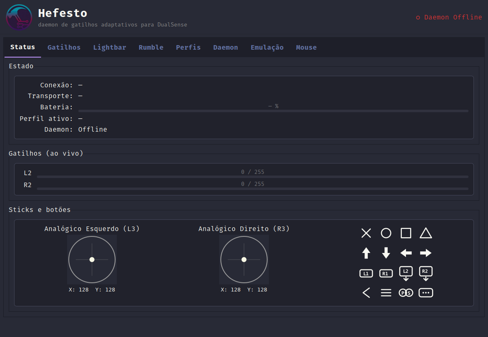
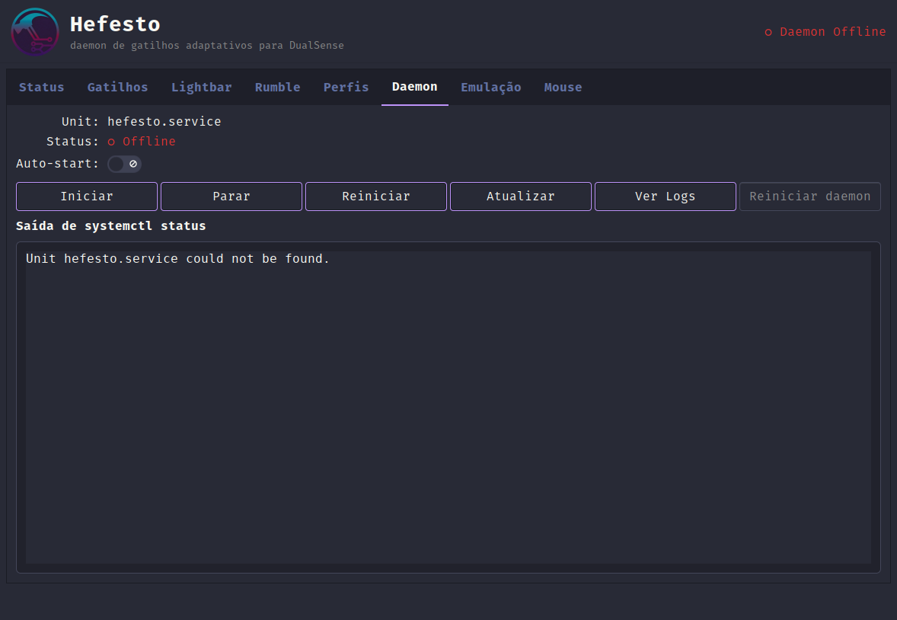
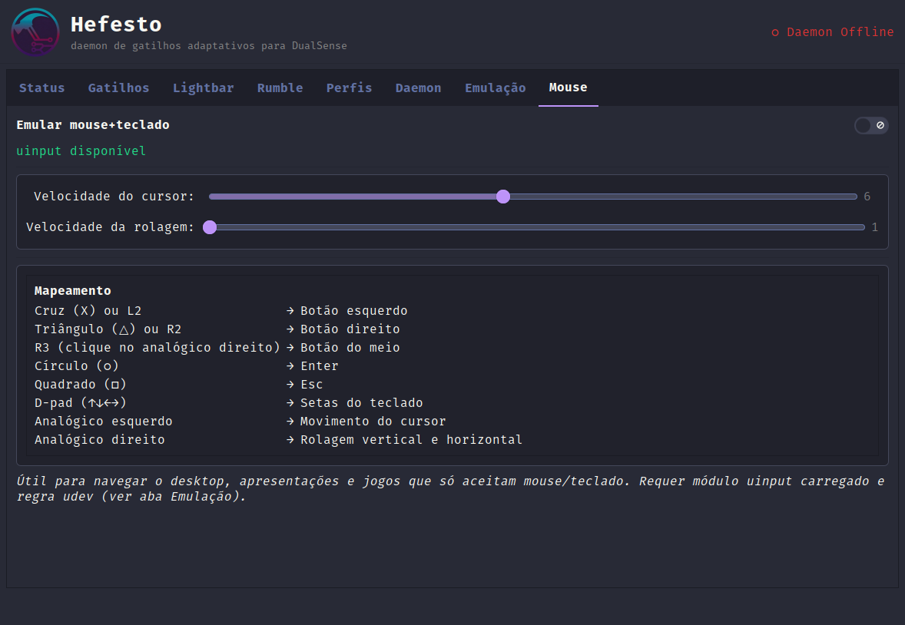
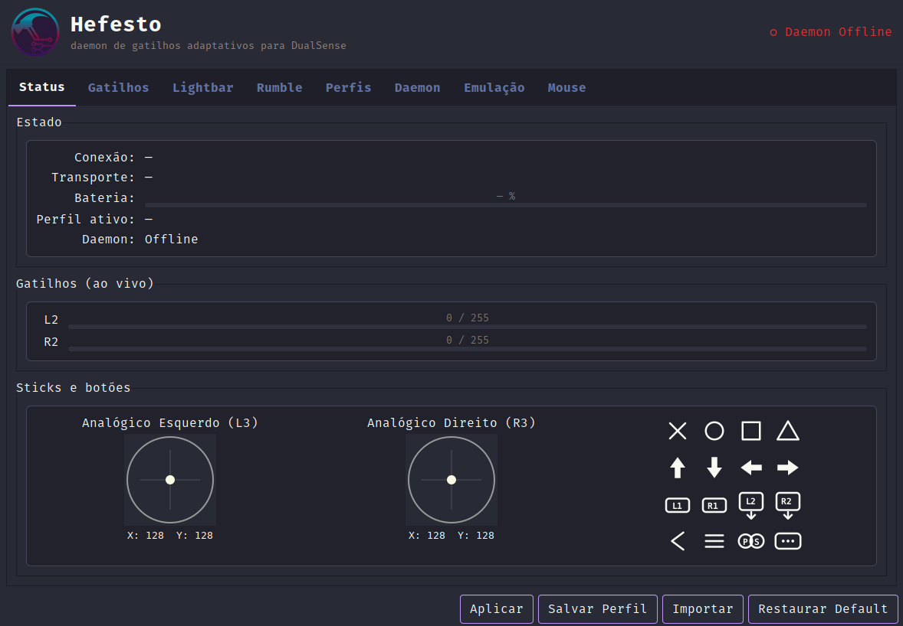
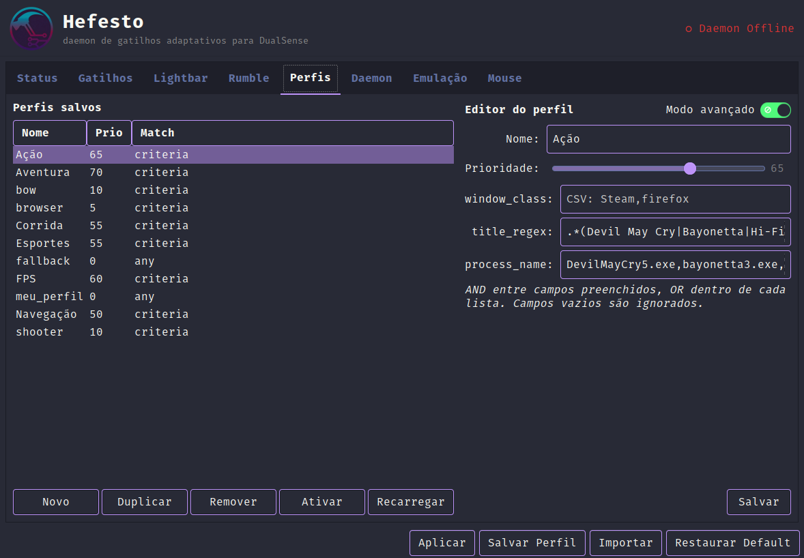
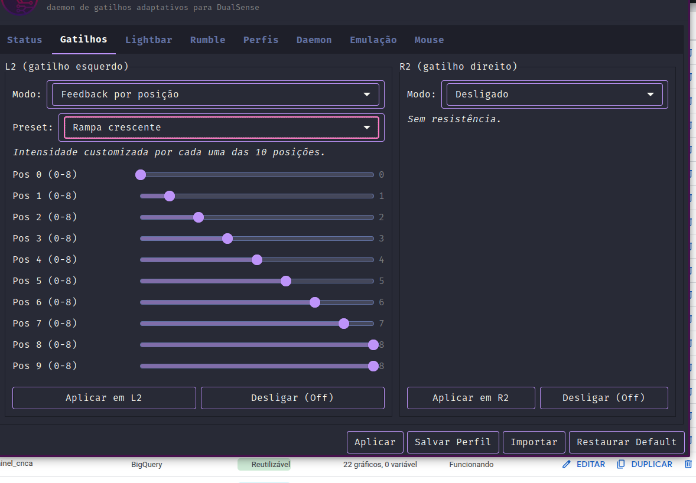
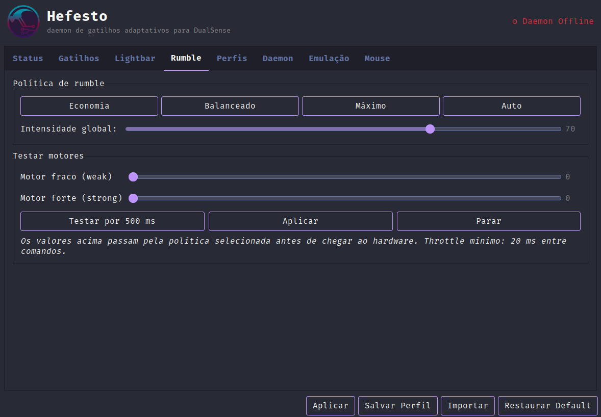

# Quickstart — Hefesto - Dualsense4Unix em 2 minutos

Guia prático pro usuário que acabou de plugar o DualSense e quer fazer funcionar — sem ler protocolo nem ADR.

---

## 1. Antes de começar

Você precisa de:

- **Linux com systemd-logind** (Pop!_OS, Ubuntu, Fedora, Arch, Debian, Mint).
- **Python 3.10 ou maior**.
- **DualSense** (PS5 controller padrão) ou **DualSense Edge**. USB ou Bluetooth.

Dependências do sistema (uma vez):

```bash
# Debian/Ubuntu/Pop!_OS
sudo apt install python3-gi python3-gi-cairo gir1.2-gtk-3.0 \
                 gir1.2-ayatanaappindicator3-0.1 libhidapi-hidraw0 \
                 libhidapi-dev libudev-dev libxi-dev

# Fedora
sudo dnf install python3-gobject gtk3 libappindicator-gtk3 hidapi-devel \
                 libudev-devel libXi-devel

# Arch
sudo pacman -S python-gobject gtk3 libappindicator-gtk3 hidapi \
                libudev libxi
```

---

## 2. Instalar

### Via `.deb` (Debian/Ubuntu/Pop!_OS/Mint)

```bash
curl -LO https://github.com/AndreBFarias/hefesto-dualsense4unix/releases/download/v1.1.0/hefesto_1.1.0_amd64.deb
sudo apt install ./hefesto_1.1.0_amd64.deb
```

### Via Flatpak (COSMIC/qualquer distro)

Ver `docs/usage/flatpak.md`. Só precisa rodar o script de udev uma vez após instalar.

### Via clone + script (desenvolvedores)

```bash
git clone git@github.com:AndreBFarias/hefesto.git
cd hefesto
./install.sh
```

O `install.sh` pergunta se você quer auto-start do daemon no boot (default **Não** — opt-in explícito). Aceita `--enable-autostart` e `--enable-hotplug-gui` pra CI.

---

## 3. Primeira abertura

Abra o Hefesto - Dualsense4Unix pelo menu de aplicativos (ou `hefesto-dualsense4unix-gui` no terminal). A janela abre com 10 abas e tema Drácula:



**Aba Status**: conexão do controle, bateria, perfil ativo, estado do daemon. Sticks L3/R3 preview ao vivo + grid 4×4 dos botões que ilumina em roxo quando você pressiona.

Plugue o DualSense (USB) ou pareie via Bluetooth. A GUI abre sozinha graças às regras udev do hotplug. A aba Status mostra **Conexão: USB** (ou BT), **Bateria: XX%** e **Daemon: Online**.

> **Tray icon não aparece no GNOME?** No GNOME 42+ (Pop!_OS, Ubuntu 22.04), a extension `ubuntu-appindicators@ubuntu.com` precisa estar habilitada. O `install.sh --yes` habilita automaticamente, mas pode exigir **logout/login** para o GNOME Shell carregar. Em outros DEs (KDE, COSMIC, XFCE), o tray funciona nativamente. Detalhes: passo 8/9 do `install.sh`.

---

## 4. Daemon: ligar ou não?



A aba Daemon mostra o estado real cruzando 3 fontes (systemd + pid file + IPC):

- **Online (systemd + auto-start)** — gerenciado pelo systemd, reinicia sozinho se falhar.
- **Online (processo avulso)** — rodando fora do systemd (ex.: `hefesto-dualsense4unix daemon start --foreground`). Use "Migrar para systemd" se quiser persistência.
- **Iniciando...** — transitório, aguarde alguns segundos.
- **Offline** — sem daemon. Clique "Iniciar".

Auto-start é opt-in — ative o switch se quer que o daemon suba junto com a sessão gráfica.

---

## 5. Emulação de mouse+teclado



Ative o toggle "Emular mouse+teclado" na aba Mouse e o DualSense vira controle de navegação:

| Botão                          | Ação                      |
|--------------------------------|---------------------------|
| Cruz (X) ou L2                 | Botão esquerdo            |
| Triângulo ou R2                | Botão direito             |
| R3 (clique no analógico dir.)  | Botão do meio             |
| Círculo                        | Enter                     |
| Quadrado                       | Esc                       |
| D-pad                          | Setas do teclado          |
| Analógico esquerdo             | Movimento do cursor       |
| Analógico direito              | Rolagem vertical/horizontal|

Ajuste a velocidade nos sliders "Velocidade do cursor" e "Velocidade da rolagem".

---

## 6. Trocar de perfil / salvar o seu



O rodapé global tem 4 botões que operam em **tudo** (gatilhos + LEDs + rumble + mouse):

- **Aplicar** — envia o estado atual das abas pro hardware em uma transação.
- **Salvar Perfil** — abre dialog, pergunta o nome, grava em `~/.config/hefesto-dualsense4unix/profiles/<nome>.json`.
- **Importar** — lê um `.json` de qualquer lugar, valida, copia pro diretório de perfis.
- **Restaurar Default** — volta o slot "Meu Perfil" à cópia de fábrica (navegacao).

Perfis pré-instalados (aba Perfis):



- `navegacao` — mouse ON, triggers off, azul suave.
- `fps` — R2 SemiAutoGun, L2 Rigid, vermelho.
- `aventura` — R2 Galloping (pulsação de carga), dourado.
- `acao` — R2 Vibração, laranja neon.
- `corrida` — R2 SlopeFeedback (pedal), ciano.
- `esportes` — R2 PulseA, verde.
- `meu_perfil` — slot editável seu.

A coluna **Prio** mostra a prioridade do matcher (maior ganha em caso de empate) e **Match** indica se é `any` (fallback universal) ou `criteria` (bate por janela/processo). O editor à direita permite ajustar nome, prioridade e regras de autoswitch (`window_class`, `title_regex`, `process_name`).

Autoswitch por janela ativa detecta automaticamente (ex.: abrir Firefox → `navegacao`; abrir Forza → `corrida`).

---

## 7. Presets de trigger por posição



Na aba Gatilhos, modos "Feedback por posição" e "Vibração por posição" expõem 10 sliders. Em vez de ajustar manualmente, use o dropdown de preset:

- **Rampa crescente/decrescente** — resistência linear.
- **Plateau central** — sweet zone no meio.
- **Stop hard/macio** — parede dura ou suave.
- **Pulso crescente / Machine gun / Galope / Senoide / Vibração final** (para Vibração).

Clique um preset → sliders populam em 1 clique. Ajuste fino depois se quiser; move qualquer slider → preset vira "Custom".

---

## 8. Política de rumble



A aba Rumble virou **política global** (multiplicador aplicado em tudo que vai pro hardware, inclusive passthrough via emulação Xbox 360):

- **Economia** — 30%, vibração sutil, preserva bateria.
- **Balanceado** — 70% (default).
- **Máximo** — 100%, usa tudo que vier.
- **Auto** — dinâmico por bateria: >50% → 100%, 20-50% → 70%, <20% → 30%. Debounce 5s pra não flapear.

Slider "Intensidade global" permite ajuste fino (0-100%) — vira modo "Custom".

---

## 9. Solução de problemas comuns

### "Daemon Offline" e não sobe

```bash
systemctl --user status hefesto-dualsense4unix.service
systemctl --user start hefesto-dualsense4unix.service
journalctl --user -u hefesto-dualsense4unix -f
```

Se a unit não existe:

```bash
hefesto-dualsense4unix daemon install-service
systemctl --user daemon-reload
```

> **A partir da v3.0.0** o daemon é resiliente sem hardware: sobe mesmo sem DualSense plugado, expõe IPC, e detecta plug-and-play via probe interno a cada 5s. Se o daemon morrer especificamente porque o hardware está ausente, é regressão — abrir issue com `journalctl --user -u hefesto-dualsense4unix -n 50`.

### Tray icon invisível no GNOME

```bash
gnome-extensions list --enabled | grep ubuntu-appindicator
```

Se vazio, habilitar:

```bash
gnome-extensions enable ubuntu-appindicators@ubuntu.com
# precisa logout/login no GNOME para renderizar
```

O `install.sh` (passo 8/9 a partir da v3.0.0) faz isso automaticamente.

### Aba Firmware sem reagir

A aba Firmware depende do binário externo `dualsensectl`, opcional:

```bash
flatpak install -y --user flathub com.github.nowrep.dualsensectl
```

Ou via GitHub source: <https://github.com/nowrep/dualsensectl>.

### Gatilhos sem efeito

Verifique as udev rules:

```bash
ls -l /dev/hidraw*   # deve ter ACL +, não só root
ls -l /dev/uinput    # idem
```

Se não tem ACL, rode `./scripts/install_udev.sh` e replugue o controle.

### DualSense desconecta sozinho (USB)

O autosuspend do kernel pode estar cortando o USB. Confirme a regra 72:

```bash
cat /sys/bus/usb/devices/*/power/control | head -5
```

Deve estar como `on` para o DualSense. Se estiver `auto`, reinstale as rules (`install_udev.sh`) e replugue.

### GUI abre e fecha ao plugar (resolvido em v1.1.0)

Se você ainda vê isso, está rodando versão antiga. Atualize para v1.1.0 (BUG-TRAY-SINGLE-FLASH-01).

---

## 10. Onde ir em seguida

- **Criar perfis avançados**: `docs/usage/creating-profiles.md`.
- **Hotkeys globais** (PS + D-pad pra trocar de perfil): `docs/usage/hotkeys.md`.
- **Integração com mods DSX** (Cyberpunk, Forza, Assetto): `docs/usage/integrating-mods.md`.
- **Suporte COSMIC/Wayland**: `docs/usage/cosmic.md`.
- **Instalar via Flatpak**: `docs/usage/flatpak.md`.
- **Arquitetura interna**: `docs/adr/` (ADRs numeradas).

---

*"O martelo não constrói o templo. Ele só ensina a pedra a lembrar da forma."*
